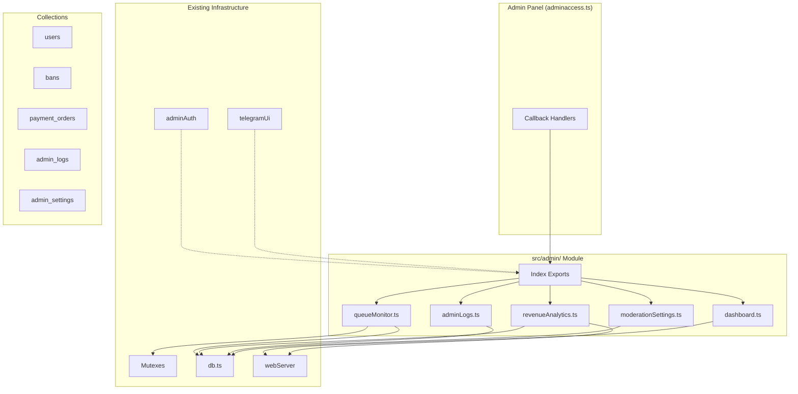

# Phase 2: Safe Feature Architecture - Admin Modules Specification

## Overview

This document specifies the design for new admin modules under `src/admin/` folder, following existing codebase patterns:
- Mutex patterns from [`src/index.ts`](src/index.ts:35) (chatMutex, queueMutex, matchMutex)
- Admin validation from [`src/Utils/adminAuth.ts`](src/Utils/adminAuth.ts:1)
- Safe UI functions from [`src/Utils/telegramUi.ts`](src/Utils/telegramUi.ts:1)
- MongoDB queries from [`src/storage/db.ts`](src/storage/db.ts:1)

---

## Architecture Diagram



---

## 1. Bot Health Dashboard (`src/admin/dashboard.ts`)

### Purpose
Read-only metrics display using existing web server health endpoints.

### Public API

```typescript
// Fetch health metrics from web server
export async function getHealthMetrics(): Promise<HealthMetrics>

// Display health dashboard in admin panel
export async function showHealthDashboard(ctx: Context): Promise<void>

// Get bot uptime and resource info
export function getBotResourceInfo(): BotResourceInfo
```

### Parameters
- `HealthMetrics`: `{ status: string; database: { mode: string; healthy: boolean; mongoConnected: boolean }; uptime: number; timestamp: string }`
- `BotResourceInfo`: `{ uptime: number; memoryUsage: NodeJS.MemoryUsage; cpuUsage: number }`

### Data Sources
- [`getDatabaseStatus()`](src/storage/db.ts:374) - Database mode and health
- [`pingDatabase()`](src/storage/db.ts:401) - MongoDB connection check
- `/health` endpoint from [`webServer.ts`](src/server/webServer.ts:56)
- `process.uptime()` - Bot uptime
- `process.memoryUsage()` - Memory stats

### Safety Measures
- **Read-only**: No mutations, only display
- **Admin check**: Uses [`isAdminContext()`](src/Utils/adminAuth.ts:47) before display
- **Error handling**: Wrapped in try-catch with [`getErrorMessage()`](src/Utils/telegramUi.ts:8)
- **Timeout**: 5-second timeout for health checks

### Integration Points
- Callback: `ADMIN_HEALTH_DASHBOARD`
- Keyboard button in main admin menu

---

## 2. Matchmaking Queue Viewer (`src/admin/queueMonitor.ts`)

### Purpose
Read-only queue inspection with safe user removal using mutex protection.

### Public API

```typescript
// Get current queue statistics
export function getQueueStats(): {
    waitingCount: number;
    premiumCount: number;
    totalInQueue: number;
    queueSetSize: number;
}

// Display queue monitor in admin panel
export async function showQueueMonitor(ctx: Context): Promise<void>

// Safely remove user from queue with mutex protection
export async function safeRemoveFromQueue(
    userId: number,
    adminId: number
): Promise<{ success: boolean; message: string }>

// Get queue details (for inspection)
export function getQueueDetails(): {
    waiting: Array<{ id: number; gender: string; preference: string }>;
    premium: Array<{ id: number; gender: string; preference: string }>;
}
```

### Parameters
- `userId`: Number - Telegram user ID to remove
- `adminId`: Number - Admin performing the action (for audit logging)

### Data Sources
- [`ExtraTelegraf.waitingQueue`](src/index.ts:96) - Standard waiting queue
- [`ExtraTelegraf.premiumQueue`](src/index.ts:98) - Premium user queue
- [`ExtraTelegraf.queueSet`](src/index.ts:100) - Queue membership set

### Safety Measures
- **Mutex protection**: Uses [`queueMutex`](src/index.ts:127) for thread-safe removal
- **Admin check**: Uses [`isAdminContext()`](src/Utils/adminAuth.ts:47)
- **Safe removal**: Removes from all three queue structures (waitingQueue, premiumQueue, queueSet)
- **Audit logging**: Logs removal with admin ID and timestamp
- **Validation**: Validates user exists in queue before removal

### Integration Points
- Callback: `ADMIN_QUEUE_MONITOR`
- Callback: `ADMIN_QUEUE_REMOVE_{userId}`
- Keyboard button in main admin menu

---

## 3. Revenue Analytics Dashboard (`src/admin/revenueAnalytics.ts`)

### Purpose
Read-only payment analytics with time-based revenue aggregation.

### Public API

```typescript
// Get revenue analytics for time period
export async function getRevenueAnalytics(
    days: number = 30
): Promise<RevenueAnalytics>

// Display revenue dashboard in admin panel
export async function showRevenueDashboard(
    ctx: Context,
    days?: number
): Promise<void>

// Get payment trend data
export async function getRevenueTrend(
    days: number
): Promise<RevenueTrend[]>
```

### Parameters
- `days`: Number - Time period for analytics (default: 30)
- `RevenueAnalytics`: `{ totalRevenue: number; totalOrders: number; completedOrders: number; averageOrderValue: number; byPeriod: Record<string, number> }`
- `RevenueTrend`: `{ date: string; revenue: number; orders: number }`

### Data Sources
- [`getPaymentOrders()`](src/storage/db.ts:2254) - Payment orders
- [`getPaymentOrderStats()`](src/storage/db.ts:2356) - Order statistics
- [`getPaymentAnalytics()`](src/Utils/starsPayments.ts:27) - Payment analytics from stars
- [`getPremiumUsers()`](src/storage/db.ts:2214) - Premium user count

### Safety Measures
- **Read-only**: No mutations, only aggregation
- **Admin check**: Uses [`isAdminContext()`](src/Utils/adminAuth.ts:47)
- **Aggregation**: Time-based grouping with date normalization
- **Currency**: Handles Telegram Stars conversion (1 Star = $0.01 USD)
- **Error handling**: Graceful fallback if payment data unavailable

### Integration Points
- Callback: `ADMIN_REVENUE_DASHBOARD`
- Callback: `ADMIN_REVENUE_PERIOD_{days}` (7, 30, 90)
- Keyboard button in main admin menu

---

## 4. Admin Audit Logging (`src/admin/adminLogs.ts`)

### Purpose
Non-blocking logging to new `admin_logs` collection for action tracking.

### Public API

```typescript
// Log admin action (non-blocking)
export async function logAdminAction(
    adminId: number,
    action: AdminAction,
    targetUserId?: number,
    details?: Record<string, unknown>
): Promise<void>

// Get audit logs with pagination
export async function getAdminLogs(
    page: number,
    limit: number,
    filter?: AdminLogFilter
): Promise<{ logs: AdminLog[]; total: number }>

// Display audit log viewer
export async function showAdminLogs(
    ctx: Context,
    page?: number
): Promise<void>
```

### Parameters
- `AdminAction`: `"ban" | "unban" | "temp_ban" | "warn" | "delete_user" | "add_premium" | "remove_premium" | "extend_premium" | "payment_refund" | "settings_change" | "queue_remove"`
- `AdminLogFilter`: `{ adminId?: number; action?: AdminAction; targetUserId?: number; startDate?: Date; endDate?: Date }`
- `AdminLog`: `{ _id: ObjectId; adminId: number; action: AdminAction; targetUserId?: number; details?: Record<string, unknown>; timestamp: Date; ipAddress?: string }`

### Data Sources
- Collection: `admin_logs` (new)
- Uses existing database connection from [`db.ts`](src/storage/db.ts:1)

### Safety Measures
- **Non-blocking**: Uses `setImmediate()` to avoid blocking main execution
- **Admin check**: Uses [`isAdmin()`](src/Utils/adminAuth.ts:29) for log viewing
- **Validation**: Validates action type and required fields
- **Indexing**: Indexes on `adminId`, `action`, `targetUserId`, `timestamp`
- **Retention**: Consider 90-day TTL for log entries

### Collection Schema

```typescript
{
    _id: ObjectId,
    adminId: number,           // Admin who performed action
    action: string,           // Action type
    targetUserId?: number,    // Affected user (if applicable)
    details?: object,         // Additional details
    timestamp: Date,          // When action occurred
    ipAddress?: string        // Optional IP (for web actions)
}
```

### Integration Points
- Callback: `ADMIN_AUDIT_LOGS`
- Callback: `ADMIN_AUDIT_LOGS_PAGE_{page}`
- Integrated into existing ban/premium actions in adminaccess.ts
- Keyboard button in main admin menu

---

## 5. Auto Moderation Settings (`src/admin/moderationSettings.ts`)

### Purpose
Configuration for auto-warn, auto-temp-ban, auto-ban thresholds.

### Public API

```typescript
// Get current moderation settings
export async function getModerationSettings(): Promise<ModerationSettings>

// Update moderation settings
export async function updateModerationSettings(
    adminId: number,
    settings: Partial<ModerationSettings>
): Promise<{ success: boolean; message: string }>

// Display moderation settings panel
export async function showModerationSettings(ctx: Context): Promise<void>

// Apply default moderation settings
export async function resetToDefaults(
    adminId: number
): Promise<{ success: boolean; message: string }>
```

### Parameters
- `ModerationSettings`: `{ autoWarnThreshold: number; autoTempBanThreshold: number; autoBanThreshold: number; tempBanDurationMs: number; enabled: boolean }`
- Default values:
  - `autoWarnThreshold`: 3 (reports)
  - `autoTempBanThreshold`: 5 (reports)
  - `autoBanThreshold`: 10 (reports)
  - `tempBanDurationMs`: 24 * 60 * 60 * 1000 (24 hours)
  - `enabled`: true

### Data Sources
- Collection: `admin_settings` (key: "moderation")
- Uses existing database connection

### Safety Measures
- **Admin check**: Uses [`isAdminContext()`](src/Utils/adminAuth.ts:47)
- **Validation**: Validates threshold ranges (min: 1, max: 100)
- **Audit**: Logs all setting changes via [`logAdminAction()`](#4-admin-audit-logging-adminlogsts)
- **Atomic updates**: Uses MongoDB atomic operations

### Collection Schema

```typescript
{
    _id: ObjectId,
    key: "moderation",        // Settings key
    autoWarnThreshold: number,
    autoTempBanThreshold: number,
    autoBanThreshold: number,
    tempBanDurationMs: number,
    enabled: boolean,
    updatedBy: number,        // Last admin who updated
    updatedAt: Date
}
```

### Integration Points
- Callback: `ADMIN_MODERATION_SETTINGS`
- Callback: `ADMIN_MODERATION_UPDATE_{setting}_{value}`
- Callback: `ADMIN_MODERATION_TOGGLE`
- Callback: `ADMIN_MODERATION_RESET`
- Keyboard button in main admin menu

---

## 6. Admin Panel Integration (`adminaccess.ts`)

### New Menu Structure

Add to main keyboard in [`adminaccess.ts`](src/Commands/adminaccess.ts:29):

```typescript
const mainKeyboard = Markup.inlineKeyboard([
    // ... existing buttons ...
    [Markup.button.callback("📊 Bot Health", "ADMIN_HEALTH_DASHBOARD")],
    [Markup.button.callback("🔄 Queue Monitor", "ADMIN_QUEUE_MONITOR")],
    [Markup.button.callback("💵 Revenue Analytics", "ADMIN_REVENUE_DASHBOARD")],
    [Markup.button.callback("📜 Audit Logs", "ADMIN_AUDIT_LOGS")],
    [Markup.button.callback("🛡️ Moderation Settings", "ADMIN_MODERATION_SETTINGS")]
]);
```

### Callback Handlers

Each module exports a function to register its callbacks:

```typescript
// In src/admin/index.ts
export function registerAdminCallbacks(bot: ExtraTelegraf): void {
    // Dashboard
    bot.action("ADMIN_HEALTH_DASHBOARD", handleHealthDashboard);
    
    // Queue Monitor
    bot.action("ADMIN_QUEUE_MONITOR", handleQueueMonitor);
    bot.action(/^ADMIN_QUEUE_REMOVE_(\d+)$/, handleQueueRemove);
    
    // Revenue Analytics
    bot.action("ADMIN_REVENUE_DASHBOARD", handleRevenueDashboard);
    bot.action(/^ADMIN_REVENUE_PERIOD_(\d+)$/, handleRevenuePeriod);
    
    // Audit Logs
    bot.action("ADMIN_AUDIT_LOGS", handleAdminLogs);
    bot.action(/^ADMIN_AUDIT_LOGS_PAGE_(\d+)$/, handleAdminLogsPage);
    
    // Moderation Settings
    bot.action("ADMIN_MODERATION_SETTINGS", handleModerationSettings);
    bot.action(/^ADMIN_MODERATION_UPDATE_(\w+)_(\d+)$/, handleModerationUpdate);
    bot.action("ADMIN_MODERATION_TOGGLE", handleModerationToggle);
    bot.action("ADMIN_MODERATION_RESET", handleModerationReset);
}
```

---

## 7. Common Patterns

### Error Handling Template

```typescript
async function safeAdminOperation(
    ctx: Context,
    operation: () => Promise<void>
): Promise<void> {
    const adminId = ctx.from?.id;
    
    // 1. Admin validation
    if (!adminId || !isAdmin(adminId)) {
        await unauthorizedResponse(ctx, "Unauthorized");
        return;
    }
    
    try {
        // 2. Safe callback answer
        await safeAnswerCbQuery(ctx);
        
        // 3. Execute operation
        await operation();
    } catch (error) {
        // 4. Graceful error handling
        console.error("[AdminModule] Error:", getErrorMessage(error));
        await safeAnswerCbQuery(ctx, "Error: " + getErrorMessage(error));
    }
}
```

### Mutex Usage Template

```typescript
async function safeQueueOperation(
    bot: ExtraTelegraf,
    adminId: number,
    userId: number
): Promise<void> {
    await bot.queueMutex.acquire();
    try {
        // Perform operation
        // Log action via adminLogs.logAdminAction()
    } finally {
        bot.queueMutex.release();
    }
}
```

---

## 8. Implementation Order

1. **adminLogs.ts** - Foundation for audit logging (other modules depend on it)
2. **moderationSettings.ts** - Configuration storage
3. **dashboard.ts** - Read-only health display
4. **queueMonitor.ts** - Queue management with mutex
5. **revenueAnalytics.ts** - Payment analytics
6. **index.ts** - Module exports and callback registration
7. **adminaccess.ts** - Menu integration

---

## Summary

This design follows existing codebase patterns:
- Uses [`Mutex`](src/index.ts:35) class for thread-safe queue operations
- Uses [`isAdminContext()`](src/Utils/adminAuth.ts:47) for authorization
- Uses [`safeAnswerCbQuery()`](src/Utils/telegramUi.ts:16) and [`safeEditMessageText()`](src/Utils/telegramUi.ts:26) for UI safety
- Uses MongoDB patterns from [`db.ts`](src/storage/db.ts:1) for data access
- Integrates seamlessly with existing admin panel callbacks
